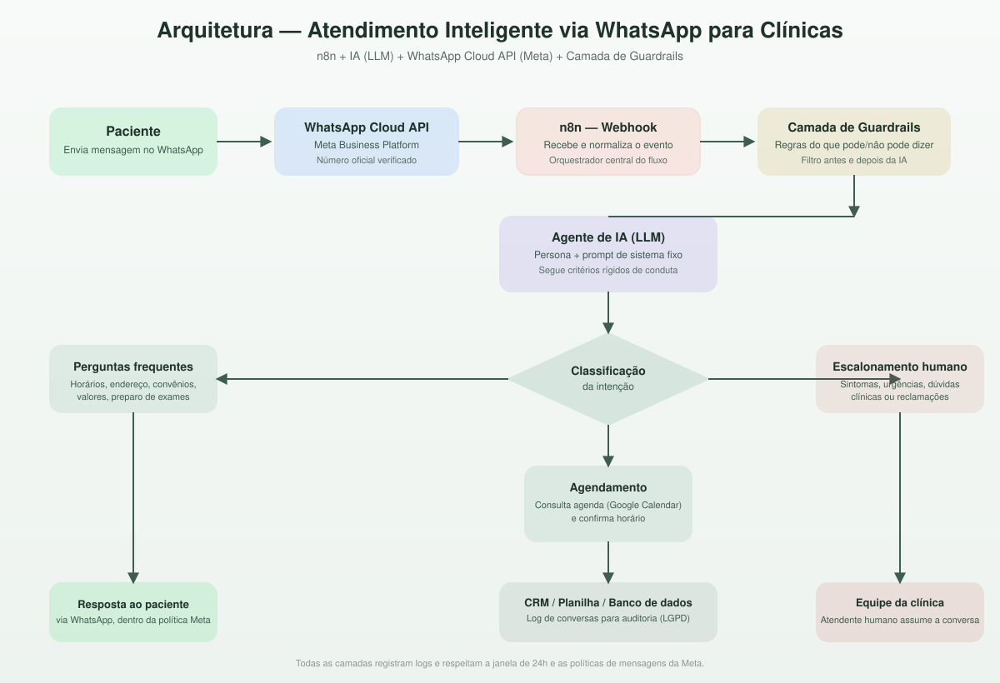

# 🏥 Atendimento Inteligente via WhatsApp para Clínicas — IA + n8n

**Automação de atendimento ao paciente com IA, orquestrada via n8n, operando 100% dentro das políticas oficiais da Meta para o WhatsApp Business Platform.**

> 🇬🇧 *English summary: End-to-end WhatsApp automation for medical/dental clinics, combining an LLM agent with a strict guardrail layer (what the bot can and cannot say), orchestrated in n8n and fully compliant with Meta's WhatsApp Business Platform policies. See [`/docs`](./docs) for the guardrail rules and Meta-compliance checklist, and [`/n8n`](./n8n) for the exportable workflow.*

---

## 📌 Status do projeto

Este é um **protótipo de portfólio**: o fluxo foi desenhado e construído no n8n (com apoio de IA generativa dentro do próprio n8n) e testado de ponta a ponta com dados fictícios. As etapas de leitura da agenda (Google Sheets) e verificação de data já rodam com integração real. A etapa de envio via WhatsApp (Meta Cloud API) está **simulada** nesta versão — a integração completa com a API oficial da Meta está em andamento.

.png)

## 📌 O problema

Clínicas recebem, em média, dezenas de mensagens por dia no WhatsApp com as mesmas perguntas: horários, endereço, convênios, valores, preparo para exames e pedidos de agendamento. A recepção perde tempo com repetição, pacientes esperam para ser respondidos fora do horário comercial, e qualquer erro de comunicação em uma clínica tem um custo mais alto do que em outros negócios — é preciso cuidado redobrado com o que a IA pode e não pode afirmar.

## 🎯 O que este projeto resolve

Um assistente de IA que atende o WhatsApp da clínica 24/7, seguindo **regras rígidas e auditáveis** sobre o que pode dizer, com **escalonamento automático para um humano** sempre que o assunto sair do escopo seguro (sintomas, diagnóstico, urgências, reclamações), e operando **dentro das regras oficiais da Meta** para não colocar em risco o número comercial da clínica.

---

## 🧩 Arquitetura



**Fluxo resumido:**
1. Paciente envia mensagem no WhatsApp da clínica.
2. A mensagem chega via **WhatsApp Cloud API (Meta)** a um webhook no **n8n**.
3. O n8n normaliza o evento e aplica a **camada de guardrails** (regras de negócio, antes de qualquer chamada à IA).
4. O **agente de IA** responde usando um prompt de sistema fixo, com escopo e tom definidos (ver [`/docs/regras-ia-atendimento.md`](./docs/regras-ia-atendimento.md)).
5. A resposta passa por um segundo filtro de guardrails (pós-processamento) antes de ser enviada.
6. Conforme a intenção da mensagem, o fluxo decide entre: responder direto (FAQ), consultar a agenda (Google Calendar/planilha) para agendar, ou **escalonar para um atendente humano**.
7. Toda a conversa é registrada em uma planilha/CRM para auditoria, métricas e conformidade com a LGPD.

---

## 🛡️ Critérios rígidos do que a IA pode e não pode dizer

Este é o núcleo do projeto: a IA **não improvisa** fora do escopo definido. Regras completas em [`/docs/regras-ia-atendimento.md`](./docs/regras-ia-atendimento.md). Resumo:

**✅ Pode fazer:**
- Informar horários de funcionamento, endereço, convênios aceitos e formas de pagamento.
- Auxiliar no agendamento, remarcação e cancelamento de consultas.
- Enviar lembretes e instruções administrativas (documentos necessários, jejum para exames, etc., **apenas conforme texto pré-aprovado pela clínica**).
- Reconhecer quando não sabe a resposta e encaminhar para um humano.

**🚫 Nunca pode fazer:**
- Dar diagnóstico, opinião clínica, orientação de tratamento ou interpretar sintomas.
- Recomendar, ajustar ou comentar sobre medicamentos e dosagens.
- Confirmar informações de saúde de terceiros ou tratar temas sensíveis sem confirmação de identidade.
- Encerrar uma conversa que envolva urgência, sinais de risco ou insatisfação sem escalonar para um humano.
- Enviar qualquer mensagem fora da janela de 24h sem usar um **template pré-aprovado pela Meta**.

---

## ✅ Conformidade com as políticas da Meta (WhatsApp Business Platform)

Detalhes completos em [`/docs/compliance-meta-whatsapp.md`](./docs/compliance-meta-whatsapp.md). Pontos centrais:

- Uso exclusivo da **WhatsApp Cloud API oficial** (Meta), nunca de soluções não-oficiais que geram banimento do número.
- Respeito à **janela de 24 horas**: fora dela, apenas mensagens de template aprovadas pela Meta.
- **Opt-in explícito** do paciente antes do início da automação.
- Opção clara de **falar com um humano** a qualquer momento.
- Nenhum envio de conteúdo promocional de saúde sem consentimento (política de Health na Meta).
- Registro e retenção de dados alinhados à **LGPD**.

---

## ⚙️ Stack utilizada

| Camada | Ferramenta |
|---|---|
| Canal de mensagens | WhatsApp Cloud API (Meta Business Platform) |
| Orquestração | n8n (self-hosted) |
| Motor de IA | LLM (Claude/GPT) com prompt de sistema fixo + guardrails |
| Agenda | Google Calendar / Google Sheets |
| Registro e auditoria | Google Sheets / banco de dados |
| Escalonamento humano | Notificação para a equipe (WhatsApp interno / e-mail) |

---

## 📂 Estrutura do repositório

```
├── README.md
├── n8n/
│   └── workflow-atendimento-clinica.json     # Workflow exportável do n8n (template)
├── docs/
│   ├── regras-ia-atendimento.md              # Prompt de sistema e guardrails completos
│   └── compliance-meta-whatsapp.md           # Checklist de conformidade com a Meta
└── assets/
    └── arquitetura.svg                       # Diagrama da arquitetura
```

---

## 🔒 Nota sobre dados

Este repositório é um **template de portfólio**: não contém dados reais de pacientes, chaves de API ou números de telefone. Todo conteúdo (nomes de clínica, exemplos de conversa) é fictício e serve para demonstrar a estrutura e o raciocínio do projeto.

---

## 💬 Sobre este projeto

Este projeto foi desenvolvido como estudo de caso de automação de atendimento com IA para o setor de saúde, com foco em três pilares: **segurança da informação clínica**, **conformidade com as plataformas da Meta** e **estabilidade operacional**. Disponível para adaptação e implementação sob demanda.

**Autor:** Luiz Fernando Evangelista Da Silva
